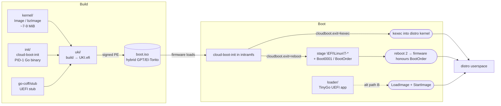

# Architecture

cloud-boot is built around a single objective: **hand an unmodified
Linux cloud image to whichever hypervisor the operator is running**,
without rebuilding the image and without sneaking custom kernel
modules in. To get there it ships **three complementary boot
paths**, a set of **userland filesystem drivers** that read real
on-disk Linux installs (including LUKS-encrypted and RAID layouts),
and a host-side **toolchain** for building UKIs, pushing OCI plans,
and writing NVRAM for the menu-then-reboot path.

The three sections under Architecture cover those pieces:

-   :material-routes:{ .lg .middle } [__Three boot paths__](three-paths.md)

    ---

    Path A (kexec), Path B (pure-UEFI loader), Path C (UKI
    menu-then-reboot) — what each one does, which trade-offs
    motivated it, and which hypervisor accepts it.

-   :material-puzzle:{ .lg .middle } [__Components__](components.md)

    ---

    The four core repos (`init`, `uki`, `loader`, `kernel`) plus
    the sibling orgs (`go-coff`, `go-filesystems`, `go-crypto`,
    `go-fde`) and how they wire together end-to-end.

-   :material-server-network:{ .lg .middle } [__Hypervisor matrix__](hypervisors.md)

    ---

    Which paths work on KVM, Apple VZ, and OpenStack; what each
    hypervisor's firmware allows and what it traps.

## The big picture in one diagram

The `init` PID-1 process is where most of the work happens once the
firmware hands off. Its disk-mode openers consume the **pure-Go
userland filesystem drivers** (`github.com/go-filesystems/*`) to read
the chained distro's `/boot/vmlinuz` + `/boot/initrd` directly out of
unmodified ext4 / XFS / btrfs (single + multi-device RAID) / ZFS
(single + mirror + RAID-Z) — with optional LUKS1/LUKS2 underneath.
See the [Filesystem drivers section](../filesystems/index.md) for
the gory details.
