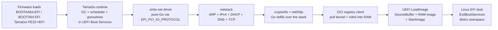
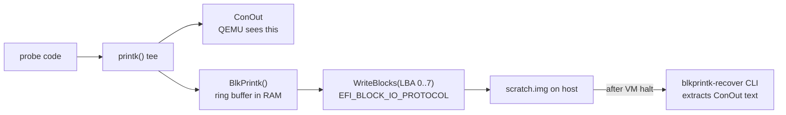

# TamaGo UEFI — pure-Go unikernel boot loader (Path D)

A fourth boot path. Where [Path B](three-paths.md#path-b--pure-uefi-loader)
gave up on Apple VZ because the firmware ships almost no UEFI network
protocols, **Path D** sidesteps that by bringing its own pure-Go
network stack on top of `EFI_PCI_IO_PROTOCOL`. Same end state as
Path A/C — distro kernel running on real hardware — but the whole
loader is a single bare-metal Go binary, no Linux intermediary.

This page is the architectural narrative. For the working design doc
with milestone status, risk register, and validation logs see
[`tamago-uefi-phase2-oci-loader.md`](https://github.com/cloud-boot/docs/blob/main/tamago-uefi-phase2-oci-loader.md).
For the runtime board source see
[`cloud-boot/tamago-uefi`](https://github.com/cloud-boot/tamago-uefi).

## Shape

Two architectural commitments:

- **Everything above the firmware is pure Go.** `CGO_ENABLED=0`, no
  vendored binaries, no language other than Go (and small per-arch
  assembly thunks for the UEFI call ABI). Justified by the project's
  no-vendoring doctrine and by the fact that VZ doesn't expose the
  higher-level UEFI services we'd otherwise reuse.
- **Network in UEFI, kernel handoff via `LoadImage`+`StartImage`, not
  kexec.** Kexec is a Linux syscall and VZ traps it. `LoadImage` is a
  Boot Service and is allowed on every UEFI we've measured.

## Why a fourth path

The first three paths each have a constraint we couldn't overcome
without inventing a new one:

| Path | Constraint | Coverage |
|---|---|---|
| A — kexec | Requires `kexec_file_load(2)` syscall | KVM/QEMU + bare metal; **not VZ** |
| B — pure UEFI (TinyGo + go-coff) | Requires UEFI `HTTP`+`DHCP4`+`DNS4`+`TCP4` | EDK2-rich firmware only; **VZ ships none of these** |
| C — UKI menu-then-reboot | Requires two boots (bootstrap + target) | All hypervisors, including VZ |

VZ is the primary production target on Apple Silicon. Path C ships
today and works, but it has a real cost: every boot pays the
two-boot tax, the bootstrap UKI ships a full Linux kernel + Go init,
and any work the bootstrap does (network, OCI fetch, signature
verify) happens after firmware has handed us a Linux kernel.

Path D collapses that to one boot in one bare-metal Go binary, with
no Linux until the final `StartImage` hands control to the kernel
we just downloaded.

## Why pure-Go networking, not UEFI services

Tested on Apple VZ via the [block-IO side-channel
observability trick](#vz-observability) (since VZ EFI doesn't route
ConOut to the host):

| Protocol | QEMU+EDK2 | Apple VZ |
|---|:---:|:---:|
| `EFI_BLOCK_IO_PROTOCOL` | ✓ | ✓ |
| `EFI_PCI_IO_PROTOCOL` | ✓ | ✓ |
| `EFI_SIMPLE_NETWORK_PROTOCOL` (SNP) | ✓ | ✗ |
| `EFI_HTTP_PROTOCOL` | ✓ | ✗ |
| `EFI_DHCP4_PROTOCOL` | ✓ | ✗ |
| `EFI_DNS4_PROTOCOL` | ✓ | ✗ |
| `EFI_TLS_PROTOCOL` | ✓ | ✗ |

VZ ships PCI IO and Block IO but not the network stack. To get
network in UEFI on VZ we have to climb up from PCI MMIO, which means
**writing the virtio-net driver, the netstack, DHCP, DNS, TLS, and
HTTP ourselves**.

Three candidate layers were considered:

- **Path X** (now abandoned): reuse `EFI_HTTP_PROTOCOL` etc. as
  firmware-provided services. Smallest LOC, biggest blast radius —
  doesn't work on VZ.
- **Path Y** (chosen): pure-Go virtio-net via PCI IO + pure-Go
  netstack + Go stdlib `crypto/tls` + `net/http`. ~3000 LOC. Works
  on every hypervisor that exposes PCI IO for virtio devices (i.e.
  all of them).
- **Path Y'** (kept as a complement): wrap
  `EFI_SIMPLE_NETWORK_PROTOCOL` as a netstack link endpoint. ~300
  LOC. Works on most UEFI firmware **except VZ**. Useful where SNP
  is the only viable transport (e.g. some EDK2 builds bind virtio
  to SNP but not to PCI IO — see R-M1.5x below).

The shipping plan is **Path Y'' = Y + Y' with a runtime chooser** at
device-enumeration time, so the final binary covers the full
hypervisor-by-arch matrix without a per-platform code split.

## Per-hypervisor / per-arch matrix

Validated end-to-end as of M2:

| Hypervisor / arch | PCI IO virtio-net | SNP | M2 driver TX/RX | Path |
|---|:---:|:---:|---|---|
| QEMU+EDK2 amd64 | ✓ | ✓ | **PASS** (1.87 s) | **Path D** |
| QEMU+EDK2 arm64 | ✓ | ✓ | **PASS** (5.92 s) | **Path D** |
| QEMU+EDK2 loong64 | ✓ | ✓ | **PASS** (5.59 s) | **Path D** |
| QEMU+EDK2 riscv64 (modern device) | ✓ | ✓ | **PASS** (6.54 s) | **Path D** |
| QEMU+EDK2 riscv64 (transitional) | ✗ R-M1.5x | ✓ | needs Y' rail (low priority) | Path D (force modern) |
| Apple VZ vfkit arm64 | ✓ | ✗ | **FAIL — R-M2c CLOSED, see below** | **Path C** (UKI menu-then-reboot) |

The cells are real boots, not theoretical. The QEMU runs use
`-device virtio-net-pci,disable-legacy=on,disable-modern=off`
to force the modern virtio device (RFC-conformant device-id `0x1041`);
without that flag QEMU defaults to the transitional device and
EDK2-stable202408 doesn't bind it to PCI IO (R-M1.5x).

**Apple VZ is on Path C, not Path D.** Two parallel experiments
were run live (PR #1 M2-A packed-ring, PR #2 M2-B post-EBS direct
MMIO) and both confirmed that VZ's virtio-net back-end ignores
non-Linux guest drivers regardless of feature mask or pre/post-EBS
context. The packed-ring negotiation succeeds (FEATURES_OK sticks)
but the device never flips USED on TX; the post-EBS direct-MMIO
client gets through `ExitBootServices` cleanly but no ARP marker
appears on the host bridge. The conclusion is that Apple's VZ
device profiles only service OS-recognized guests (Linux's
in-kernel virtio-net); bare-metal Go can't reach the wire.
Path C (UKI menu-then-reboot) remains the production rail on
Apple Silicon. Detailed evidence in
[`tamago-uefi-phase2-oci-loader.md`](https://github.com/cloud-boot/docs/blob/main/tamago-uefi-phase2-oci-loader.md)
§5 R-M2c CLOSED.

## The three quirks that mattered

The boot story has three non-obvious surprises that anyone working
on this code should know about. Each one was an explicit pivot:

### Quirk 1 — VZ firmware is minimal by design

The first plan was Path X (call `EFI_HTTP_PROTOCOL.Request` directly
and let firmware do the network). Cancelled the moment we read
`vfkit.md` line 17:

> *VZ firmware has no HTTP/TCP/DHCP/DNS → Path B can't fetch plans*

Apple ships only the UEFI surface needed for the Boot Manager to
load an EFI binary from a disk. Everything above
`EFI_PCI_IO_PROTOCOL` we have to provide ourselves.

### Quirk 2 — VZ requires `VIRTIO_NET_F_MTU` (bit 3) to negotiate

Spec-wise `MTU` is informational: §5.1.3 of the virtio spec says
the field is "advisory" for the driver. Apple's virtio-net device
treats it as **mandatory for `FEATURES_OK` to stick** — without it,
the device clears `FEATURES_OK` on read-back and the negotiation
fails. The R-M2b diagnosis confirmed this empirically by walking
each candidate feature bit one at a time and observing which one
made the status read return `0x0b` instead of `0x03`.

Fix: include `VIRTIO_NET_F_MTU` in the accepted-features mask. On
QEMU+EDK2 this bit isn't offered by default and the negotiated mask
is unchanged. On VZ it's the one bit that makes the difference.

### Quirk 3 — VZ EFI doesn't route ConOut to virtio-console

vfkit's `--device virtio-serial,logFilePath=path` captures zero
bytes from pre-EBS code. Apple's UEFI implementation just doesn't
publish a serial ConOut handle that the host can observe. This
makes VZ pre-EBS effectively a black box.

The fix is the **block-IO side-channel** ([M1.6](#vz-observability)):
attach a writable virtio-blk scratch disk, write our probe output
to it via `EFI_BLOCK_IO_PROTOCOL.WriteBlocks`, halt the VM, recover
the disk from the host. Slow but universal.

## VZ observability

Both sinks run in parallel. On QEMU the recovered text matches what
ConOut printed, byte for byte. On VZ the ConOut sink is silent but
the recovered text is exactly what would have been printed. This
unblocked R-M1'a (VZ capability matrix) and all subsequent VZ
validation.

## Where we are

- ✅ **Phase 1** — 4 arches boot end-to-end on QEMU+EDK2 and VZ; full
  Go runtime (GC, scheduler, goroutines) reaches `main`, prints over
  ConOut on QEMU + recovers via block-IO on VZ.
- ✅ **Phase 2 M0** — design doc + scaffolding (memory-map snapshot,
  ExitBootServices thunk compiled but not called).
- ✅ **Phase 2 M1 / M1.5 / M1.6** — virtio-net device discovery via
  PCI IO; SNP enumeration as the complementary rail; block-IO
  side-channel for VZ observability; VZ capability matrix surfaced.
- ✅ **Phase 2 M2** — pure-Go virtio-net driver with feature
  negotiation, virtqueue allocation, ARP TX/RX. **4/5 QEMU+EDK2
  cells PASS end-to-end**. VZ tested via both M2-A (RING_PACKED
  packed-ring) and M2-B (post-EBS direct MMIO) and BOTH FAIL —
  see R-M2c CLOSED below for the empirical evidence. **Path D
  scope is QEMU/EDK2 only**; VZ stays on Path C.
- ⏸️ **M2.1** (SNP wrapper) — low priority; SNP not on VZ, and
  modern-device-forcing covers riscv64 on QEMU.
- ⏸️ **M2.2** (`LinkEndpoint` interface + chooser) — low priority;
  if M2.1 stays low, M2.2 follows.
- ⏳ **M3-minimal** — hand-rolled pure-Go ARP+IPv4+ICMP+UDP+TCP
  stack. gvisor was attempted (R-M3'a) and **compiled clean but
  runtime-crashed** EDK2 CpuDxe with a #GP under QEMU+EDK2 amd64
  before our dispatcher ever ran. The mitigation (drop gvisor,
  hand-roll a minimal stack) was the documented fallback in the
  original M3 design. Scope: ARP, IPv4 send/recv, ICMP4 (ping),
  UDP4 (DHCP, DNS), TCP4 client-side (HTTP fetch). ~3000 LOC,
  BSD-3, QEMU+EDK2 4 arches.
- ⏳ **M4 / M5 / M6** — DHCP4, DNS+HTTP, TLS+HTTPS.
- ⏳ **M7** — OCI registry client (port the pure-Go pieces from
  [`cloud-boot/init`](https://github.com/cloud-boot/init)).
- ⏳ **M8** — Linux EFI-stub `LoadImage`+`StartImage` handoff
  (per-arch boot-params layout: zero-page on amd64, FDT pointer on
  arm64/loong64/riscv64).

## Open risks

| ID | Severity | Status | One-liner |
|---|---|---|---|
| R-M2c | — | **CLOSED 2026-06-08** | Apple VZ virtio-net gates non-OS clients; Path D ships QEMU-only, VZ stays on Path C |
| R-M3'a | — | **CLOSED 2026-06-08** | gvisor compile-clean but runtime crashes EDK2 CpuDxe with #GP; M3 falls back to hand-rolled minimal stack |
| R-M3'b | LOW | open | tamago-pie loong64 overlay missing `zsyscall_tamago_loong64.go`; non-blocking now that gvisor is dropped |
| R-M1.5x | LOW | confirmed, narrowed | riscv64 EDK2 doesn't bind transitional virtio-net to PCI IO; modern device works |
| R-M8 | open | not yet started | per-arch Linux EFI-stub handoff ABI |

## Files

- Runtime board: [`github.com/cloud-boot/tamago-uefi`](https://github.com/cloud-boot/tamago-uefi)
  — board files per arch, UEFI thunks, virtio drivers, probes.
- Working design doc with milestones + risks + validation logs:
  [`docs/tamago-uefi-phase2-oci-loader.md`](https://github.com/cloud-boot/docs/blob/main/tamago-uefi-phase2-oci-loader.md).
- TamaGo upstream + cloud-boot-local patches:
  - [`docs/tamago-loong64-fork.patch`](https://github.com/cloud-boot/docs/blob/main/tamago-loong64-fork.patch)
    — loong64 GOOS=tamago port, opened upstream as
    [`usbarmory/tamago-go#17`](https://github.com/usbarmory/tamago-go/pull/17).
  - [`docs/tamago-loong64-pie.patch`](https://github.com/cloud-boot/docs/blob/main/tamago-loong64-pie.patch)
    — `-buildmode=pie` overlay (cloud-boot-local, kept out of upstream
    per maintainer request).
  - [`docs/edk2-riscv64-protection-fix.patch`](https://github.com/cloud-boot/docs/blob/main/edk2-riscv64-protection-fix.patch)
    — drive-by `~` → `!` assert typo fix in EDK2's
    `BaseRiscVMmuLib.c`, found during the riscv64 firmware audit.
    **Submitted upstream as
    [tianocore/edk2#12650](https://github.com/tianocore/edk2/pull/12650).**
  - There is **no** second EDK2 patch. An earlier note hypothesised a
    NULL-`DescriptorVersion` deref in `CoreGetMemoryMap` on riscv64
    (R-M0a). On verification, both `master` and `edk2-stable202408`
    already guard all three OUT writes (`DescriptorVersion`,
    `DescriptorSize`, `MapKey`) with `if (X != NULL)`. The riscv64
    fault was **our** client-side bug — the 4-arg `efiCall` thunk left
    a garbage non-NULL value in the `DescriptorVersion` register slot,
    which EDK2 faithfully wrote to. Fixed on our side by widening
    `efiCall` to 5 args and passing a real `*uint32` (commit
    [cfa6dca](https://github.com/cloud-boot/tamago-uefi/commit/cfa6dca)).
    Nothing to upstream.
