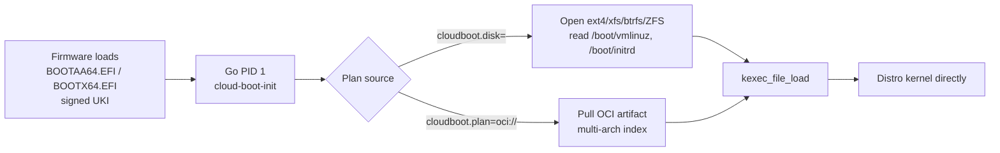
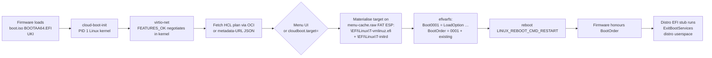
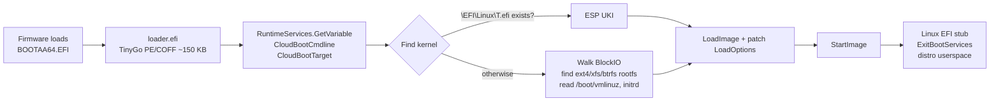

# Three boot paths

cloud-boot ships three pipelines because no single one works on every
hypervisor the project targets. Each path lands on the same end state
— a stock distro userspace from an unmodified cloud image — but the
journey is different.

## Path A — UKI + init + kexec

The original flow. Targets QEMU/KVM, OpenStack, bare metal.

**Why this exists** — `kexec` lets the bootstrap kernel hand off its
memory to the distro kernel without going through the firmware
again. Fast, surgical, well-understood.

**What you need from the hypervisor** — a working
`kexec_file_load(2)` syscall in the bootstrap kernel context. That
covers KVM, QEMU, OpenStack Nova, bare metal, almost everything.

**What it doesn't cover** — Apple `Virtualization.framework`. VZ
deliberately fails `kexec_file_load`. See [Path C](#path-c--uki-menu-then-reboot).

## Path C — UKI menu-then-reboot

The Apple-VZ production target. Also works fine on KVM if you want
the `BootOrder` semantics instead of `kexec`.

**Why this exists** — VZ traps `kexec_file_load` *and* VZ firmware
ships almost no UEFI protocols (no `HTTP` / `TCP4` / `DHCP4` /
`DNS4`), so we can't reach the network from pure UEFI. The
networking and filesystem walks have to happen from a Linux kernel
context; the trick is that the **next boot** loads the target via
the firmware's standard UEFI Boot Manager — which is allowed.

**The two-disk dance** (vfkit example):

- `boot.iso` — immutable hybrid ISO. iso9660 + El Torito → the UKI
  at `\EFI\BOOT\BOOTAA64.EFI`. Read-only.
- `menu-cache.raw` — writable GPT disk with one FAT32 ESP labelled
  `cloud-boot-cache`. This is where `init` stages the chosen
  target and where the firmware finds `Boot0001` on the next boot.

The cache disk is **idempotent**: `uki/scripts/make-cache-disk.sh
menu-cache.raw 256` re-runs safely; existing partitions and
boot entries are reused, not nuked. Returning to the menu after a
target has been staged uses `uki/scripts/reset-cloud-boot.sh` (or
`efibootmgr -B 0001 -b 0001 && efibootmgr --bootorder $(prev)`).

## Path B — Pure-UEFI loader

A diagnostic surface. Lives in the [`loader/`](https://github.com/cloud-boot/loader)
repo. TinyGo PE/COFF UEFI application; stays inside Boot Services
all the way to `StartImage`.

**Status: Phases A–C committed; D–J abandoned for Apple VZ.**

The loader was originally going to do the full networked plan
fetch in pure UEFI (Phases D–J: HTTP, OCI, DHCP, …) but the VZ
firmware proved to lack the necessary protocols, and the virtio-net
device rejects `FEATURES_OK` from any UEFI-context client. Path C
took over as the Apple-VZ production target. The loader is still
useful as a diagnostic + on QEMU/OVMF and EDK2 hardware where the
protocol coverage is better; it ships the **six-distro Linux
cascade** end-to-end (Debian, Ubuntu, Fedora, AlmaLinux, openSUSE,
Alpine) **plus a BSD branch** (`CloudBootTarget=freebsd|netbsd|openbsd`)
that hands off to the BSD's own `loader.efi` via
`LoadImage(DevicePath, SourceBuffer=NULL)` so the chained loader can
introspect its own `LoadedImage.FilePath` to find `currdev`.
FreeBSD 14.3 reaches the GENERIC arm64 login prompt on QEMU;
NetBSD 10.0 (GENERIC64) reaches `login:`; OpenBSD has routing code
in tree but no official arm64 cloud image to test against yet.

The loader publishes `EFI_LOAD_FILE2_PROTOCOL` under
`LINUX_EFI_INITRD_MEDIA_GUID` so the Linux EFI stub can pull the
initrd via `LoadFile2` — that's the modern initrd handoff convention
since kernel 5.8.

## Compatibility matrix

| Hypervisor | Path A · kexec | Path B · pure UEFI | Path C · reboot |
| --- | :---: | :---: | :---: |
| QEMU/KVM (x86_64 + aarch64) | ✓ | ✓ | ✓ |
| Apple `Virtualization.framework` | ✗ trapped | ✗ no net | **✓ primary** |
| OpenStack Nova / libvirt / KVM | ✓ | ✓ | ✓ |
| Bare metal UEFI | ✓ | ✓ (firmware-dependent) | ✓ |
| EDK2 + virtio-blk-only | — | ✓ | ✓ |

See the [Hypervisor matrix](hypervisors.md) for which firmware
protocols each combination exposes and which gotchas to watch for.
