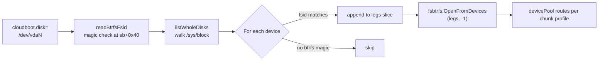

# Multi-device discovery

A multi-device pool — btrfs RAID0/10/5/6 or any ZFS raidz — needs
**all** data-bearing legs presented to the FS opener. cloud-boot-init
auto-discovers them by walking `/sys/block` and probing each
candidate's on-disk identity, so the operator only has to point
`cloudboot.disk=` at *one* of the legs.

## btrfs — `findBtrfsLegs`

`init/cmd/cloud-boot-init/disk_btrfs_linux.go`

btrfs identifies a pool by the 16-byte `fsid` in the superblock at
byte offset `0x20` (within the superblock at sb-start `0x10000`).

```go
func findBtrfsLegs(primary string) ([]string, error) {
    primaryFsid, err := readBtrfsFsid(primary)
    // ... walk /sys/block, read each candidate's fsid, group by match
}
```

Flow:



Single-leg installs (SINGLE / DUP / RAID1 / RAID1Cn / RAID10) fall
back to the existing single-device opener — see the
`if lerr != nil || len(legs) <= 1` branch in
`disk_fs_linux.go:openFS`.

## ZFS — `findZFSVdevs`

`init/cmd/cloud-boot-init/disk_zfs_linux.go`

ZFS identifies a pool by `pool_guid` (uint64 in the vdev label's
top-level NVList) and each leg by `guid`. The top vdev's children
have an explicit ordering (`vdev_tree.children[*]` array of NVLists)
that `OpenFromDevices` requires.

```go
func findZFSVdevs(pool string) ([]string, error) {
    // 1. listWholeDisks → candidate paths
    // 2. fszfs.ProbeLabel(f, 0) for each → LabelInfo
    // 3. filter by PoolName + PoolGUID
    // 4. sort by ThisGUID's position in LeafGUIDs
    // 5. verify all slots filled
}
```

`fszfs.ProbeLabel` decodes the label NVList (no FS open, no DMU
traversal — purely a XDR parse). The fields it pulls:

| Field | Type | Use |
| --- | --- | --- |
| `PoolName` | string | filter by name |
| `PoolGUID` | uint64 | authoritative pool identity |
| `ThisGUID` | uint64 | this leg's own guid |
| `TopGUID` | uint64 | top vdev's guid |
| `Type` | string | `"file"` / `"disk"` / `"mirror"` / `"raidz"` |
| `NParity` | uint64 | 0 for non-raidz, 1/2/3 for raidz |
| `Ashift` | uint64 | sector shift |
| `LeafGUIDs` | []uint64 | top vdev's children in declaration order |

Sort step:

```go
leafIdx := make(map[uint64]int)
for i, g := range first.LeafGUIDs { leafIdx[g] = i }
out := make([]string, len(first.LeafGUIDs))
for _, h := range hits {
    if idx, ok := leafIdx[h.info.ThisGUID]; ok {
        out[idx] = h.path
    }
}
```

If any slot is empty after the sort, an error names which indices
are missing — so a degraded pool gets a useful diagnostic instead
of a silent fail-open.

## runDiskZFS dispatch

`disk_zfs_linux.go:runDiskZFS` switches based on leg count:

```go
legs, err := findZFSVdevs(pool)
if len(legs) == 1 {
    // Single-vdev or single-leg mirror — use OpenDataset.
    fs, err = fszfs.OpenDataset(legs[0], -1, datasetPath)
} else {
    // Multi-vdev — wrap each leg, feed to OpenFromDevices.
    backends := make([]fszfs.BlockBackend, 0, len(legs))
    for _, leg := range legs {
        f, _ := os.OpenFile(leg, os.O_RDWR, 0o600)
        backends = append(backends, &zfsFileBackend{f: f})
    }
    fs, err = fszfs.OpenFromDevices(backends, -1, datasetPath)
}
```

## Block-device candidate filter — `listWholeDisks`

Both `findBtrfsLegs` and `findZFSVdevs` reuse the shared helper
`listWholeDisks()` (in `disk_resolve_linux.go`). It walks
`/sys/block`, returning `/dev/<name>` for every whole-disk block
device — virtio-blk, NVMe, SATA, anything attached to the VM. It
deliberately **excludes** partitions (a btrfs/ZFS pool's leg is a
partition when the disk is GPT-formatted; but the cloud-boot
images cloud-boot opens are typically raw whole-disk).

If your install puts the FS leg on a partition rather than a whole
disk, set `cloudboot.disk=/dev/vda3` (the partition) and the
single-device opener will work — partition tables are auto-detected
via `partIndex = -1` in the `Open` call.

## Failure modes

| Symptom | Cause | Fix |
| --- | --- | --- |
| `btrfs leg discovery: read primary fsid: ... magic mismatch at sb+0x40` | The primary `cloudboot.disk=` isn't a btrfs device. | Point at the correct partition; this is logged as warning + falls back to single-device opener. |
| `zfs: pool "X": missing N leg(s) (indices [1 2])` | One or more legs aren't attached to the VM. | Attach the missing virtio-blk devices and re-boot, or accept degraded operation (currently unsupported — see Reed-Solomon roadmap). |
| `zfs: pool "X": duplicate leg at id N` | Two devices report the same `ThisGUID` — either a clone of the same disk image is mounted twice, or the pool was forcibly imported on another host. | Detach the duplicate. |
| `btrfs: logical address 0x... not in any known chunk` | Tried to open a RAID0/5/6 leg single-device (the chunk's stripe lives on another device). | Make sure the other legs are also attached so `findBtrfsLegs` picks them up. |
