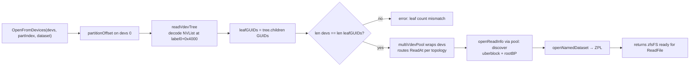

# ZFS multi-vdev + RAID-Z

*Algorithm reference: `module/zfs/vdev_raidz.c:vdev_raidz_map_alloc`,
OpenZFS 2.1.x.*

This page walks how `go-filesystems/zfs` opens and routes reads
against a multi-vdev pool — mirror or RAID-Z1/Z2/Z3.

## Source files

| File | Role |
| --- | --- |
| `nvparse.go` | NVList XDR decoder. |
| `vdev.go` | `vdev` tree type + `parseVdevTree` + `readVdevTree`. |
| `raidz.go` | `raidzMapAlloc` + `raidzRead` (per-IO healthy-path geometry). |
| `multidev.go` | `multiVdevPool` — the `blockBackend` wrapper that intercepts ReadAt. |
| `probe.go` | `ProbeLabel` + `LabelInfo` — public helpers cloud-boot-init uses for label-only discovery. |
| `zfs.go` | `OpenFromDevices` builds the pool. |

## Open flow



## NVList — `vdev_tree`

Inside label 0 (at byte offset 16 KiB from partition start), the
XDR-encoded NVList contains a `vdev_tree` nested NVList. For a
3-device raidz1 it looks like:

```text
vdev_tree:
    type        = "raidz"
    id          = 0
    guid        = 13844752501013526996
    nparity     = 1
    ashift      = 9
    asize       = 388497408
    children[]:
        [0]: type="file", id=0, guid=2356164864592060698, path="…/d0.img"
        [1]: type="file", id=1, guid=6304913170613720648, path="…/d1.img"
        [2]: type="file", id=2, guid=8843504757741023147, path="…/d2.img"
```

`parseVdevTree` decodes this into a Go struct:

```go
type vdev struct {
    typ      vdevType   // "raidz", "mirror", "file", "disk", ...
    id       uint64
    guid     uint64
    ashift   uint64
    nparity  uint64
    path     string     // leaf only
    children []*vdev
}
```

## `raidzMapAlloc` — the geometry

```go
// raidzMapAlloc computes the column layout for a logical IO at
// sector offset b with size s sectors, on a RAID-Z vdev with
// `dcols` children and `nparity` parity columns.
func raidzMapAlloc(b, s uint64, dcols, nparity int, ashift uint) *raidzMap {
    dataCols := dcols - nparity
    q := s / uint64(dataCols)              // full rows
    r := s % uint64(dataCols)              // remainder
    bc := uint64(0)
    if r != 0 {
        bc = r + uint64(nparity)           // "big" columns in partial row
    }
    acols := bc
    if q != 0 {
        acols = uint64(dcols)              // accessed columns
    }

    sectorSize := int64(1) << ashift
    rm := &raidzMap{
        nparity: nparity,
        dcols:   dcols,
        parity:  make([]raidzCol, nparity),
        data:    make([]raidzCol, int(acols) - nparity),
    }

    for c := uint64(0); c < acols; c++ {
        col := (b + c) % uint64(dcols)
        coff := int64((b / uint64(dcols)) << ashift)
        if col < b % uint64(dcols) {
            coff += sectorSize
        }
        size := int(q << ashift)
        if c < bc {
            size = int((q + 1) << ashift)
        }
        rc := raidzCol{childIdx: int(col), offset: coff, size: size}
        if int(c) < nparity {
            rm.parity[c] = rc
        } else {
            rm.data[int(c) - nparity] = rc
        }
    }
    return rm
}
```

For a healthy read:

```go
func raidzRead(children []io.ReaderAt, dataArea int64,
               offset, size int64, nparity int, ashift uint) ([]byte, error) {
    b := uint64(offset / (1 << ashift))
    s := uint64(size   / (1 << ashift))
    rm := raidzMapAlloc(b, s, len(children), nparity, ashift)

    out := make([]byte, 0, size)
    for _, dc := range rm.data {
        buf := make([]byte, dc.size)
        children[dc.childIdx].ReadAt(buf, dataArea + dc.offset)
        out = append(out, buf...)
    }
    return out, nil
}
```

The parity columns aren't read — the data column reads are
concatenated in column order to produce the original payload.
That's why the layout works: every byte of the original IO maps
to a unique (data_col, position_in_col) pair.

## `multiVdevPool.ReadAt`

The wrapper exposes a single `blockBackend.ReadAt` to the rest of
the lib so the existing read paths (`readBlock`, `readDataBlock`,
…) work unchanged on top of multi-vdev:

```go
func (m *multiVdevPool) ReadAt(p []byte, off int64) (int, error) {
    dataAreaStart := m.partOff + vdevLabelStartSize
    if off < dataAreaStart {
        // Label / uberblock read — go to leg 0.
        return m.primary.ReadAt(p, off)
    }
    logical := off - dataAreaStart

    switch m.tree.typ {
    case vdevTypeMirror:
        // All legs identical — serve from leg 0 with fallback.
        for _, leg := range m.leaves {
            if n, err := leg.ReadAt(p, off); err == nil { return n, nil }
        }
        ...
    case vdevTypeRAIDZ:
        out, err := raidzRead(asReaderAt(m.leaves), dataAreaStart,
                              logical, int64(len(p)),
                              int(m.tree.nparity), uint(m.tree.ashift))
        if err != nil { return 0, err }
        copy(p, out)
        return len(p), nil
    case vdevTypeFile, vdevTypeDisk:
        // Single-leaf root — passthrough.
        return m.primary.ReadAt(p, off)
    }
}
```

## `ProbeLabel` — label-only discovery

Used by cloud-boot-init's `findZFSVdevs` to assemble the correct
leaf ordering BEFORE calling `OpenFromDevices`.

```go
type LabelInfo struct {
    PoolName     string
    PoolGUID     uint64
    TopGUID      uint64
    ThisGUID     uint64    // GUID of THIS leaf
    VdevChildren uint64
    Type         string    // "file"/"disk"/"mirror"/"raidz"
    NParity      uint64
    Ashift       uint64
    LeafGUIDs    []uint64  // ordered list from vdev_tree.children
}

info, err := fszfs.ProbeLabel(r, partOff)
```

No DMU / dataset traversal — purely a label-NVList XDR parse.

## Healthy-read only

The current implementation supports **healthy-path** reads only.
A degraded read (one or more legs missing) would need:

- **RAID-Z1 (nparity=1)**: XOR the parity column with the
  remaining data columns to recover the missing one. ~100 lines.
- **RAID-Z2 (nparity=2)**: Q parity = `Σ data_j · 2^(j·1)` over
  GF(2^8). Solve a 2×2 linear system to recover up to 2 missing
  columns. ~300 lines + a GF(2^8) multiplication table.
- **RAID-Z3 (nparity=3)**: P + Q + R parities, solving a 3×3
  system. ~400 lines.

The healthy-path code is structured so that adding degraded reads
is a per-profile branch in `raidzRead` that consults parity
columns when one or more data columns fail. It hasn't been
shipped because cloud-boot mostly reads healthy fresh images;
degraded operation requires a deliberate setup.

## Test fixtures

`mock/pkg/go-filesystems/zfs/testdata/raid/*.tar.zst` — five
layouts. Generated in a Debian 12 VM with `zfsutils-linux 2.1.11`
+ `zfs-dkms` (built against the running kernel):

```sh
truncate -s 128M d{0..N-1}.img
sudo zpool create -f <pool> raidz1 $PWD/d0.img $PWD/d1.img $PWD/d2.img
sudo zfs create <pool>/data
echo hello-from-raidz1 | sudo tee /<pool>/data/hello.txt
sudo head -c 65536 /dev/urandom > /<pool>/data/blob.bin
md5sum /<pool>/data/hello.txt /<pool>/data/blob.bin
sudo zpool export <pool>
tar c d*.img | zstd -19 > testdata/raid/raidz1.tar.zst
```

The test in `raid_smoke_test.go::TestRAIDFixture_RaidZ` extracts
each fixture, opens all legs via `OpenFromDevices(devs, -1,
"data")`, then verifies the contents match the recorded md5s.

All three raidz levels pass.
